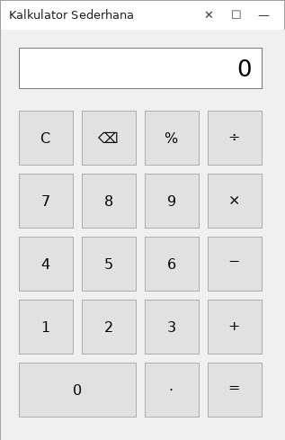
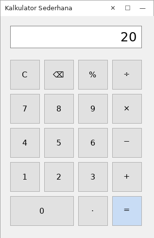
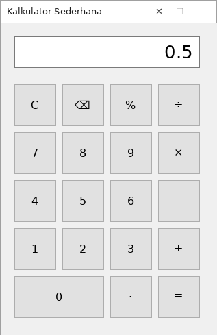
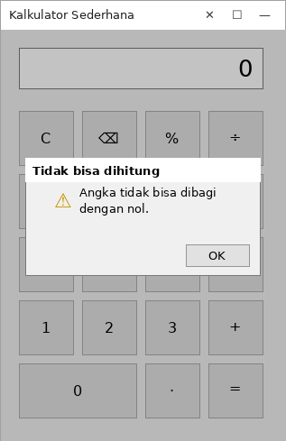

# Kalkulator Sederhana (Windows Forms + C#)

Ini kalkulator desktop bergaya keypad — mirip kalkulator bawaan HP — yang dibuat mengikuti alur dari modul *Hand-on Lab: Kalkulator Desktop dengan C#*. Tapi kodenya ditulis ulang dari nol dengan gaya dan penamaan sendiri, bukan salin-tempel dari modul, dan ada beberapa fitur tambahan yang tidak ada di modulnya.

## Apa yang beda dari modul aslinya

Modul lab memakai variabel `firstNumber`, `secondNumber`, `operation`, dan menghitung hasil langsung di dalam `btnEquals_Click` pakai `switch`. Di project ini:

- Logika perhitungan dipisah ke method sendiri (`HitungDanTampilkan` dan `BagiDenganAman`), bukan ditumpuk semua di event `Click`.
- Dipakai `double.TryParse` alih-alih `double.Parse`, jadi kalau ada input aneh program tidak langsung crash.
- Ditambah dua tombol baru yang di modul cuma disebut sebagai "tantangan pengembangan": **Backspace (⌫)** untuk menghapus satu digit terakhir, dan **Persen (%)** untuk mengubah angka di layar jadi bentuk desimal persennya.
- Ada logika supaya kalau user pilih operator lalu ganti pikiran pilih operator lain (tanpa pencet `=`), kalkulator tetap menghitung hasil sementara dulu — bukan cuma mengganti operatornya begitu saja.

## Fitur

- Operasi dasar: tambah, kurang, kali, bagi.
- Validasi pembagian dengan nol (muncul kotak pesan, bukan error/crash).
- Titik desimal, dengan pengecekan supaya satu angka tidak bisa punya dua titik.
- Backspace untuk koreksi input tanpa harus clear semua.
- Persen untuk konversi cepat, misal `50` jadi `0.5`.
- Clear untuk reset ke kondisi awal.

## Struktur project

```
KalkulatorSederhana/
├── KalkulatorSederhana.csproj
├── Program.cs
├── Form1.cs              ← logika kalkulator ada di sini
├── Form1.Designer.cs     ← layout tombol & komponen
└── images/                ← gambar tampilan aplikasi
```

## Tampilan aplikasi

> Catatan jujur: gambar-gambar di bawah ini adalah simulasi tampilan (dibuat untuk memperlihatkan hasil akhirnya), bukan tangkapan layar asli dari Visual Studio — soalnya proses pembuatan project ini dilakukan di lingkungan yang tidak punya Windows/Visual Studio untuk menjalankan aplikasinya secara langsung. Layout dan teksnya sudah dibuat presisi mengikuti koordinat di `Form1.Designer.cs`, jadi begini kira-kira bentuknya kalau di-build. Kalau kamu build sendiri di komputermu, ganti saja gambar-gambar ini dengan screenshot asli hasil `F5` di Visual Studio.

**Tampilan awal**



**Setelah menghitung `12 + 8`**



**Memakai tombol persen (`50` → `%`)**



**Mencoba membagi dengan nol**



## Cara menjalankan

1. Buka folder ini lewat **File → Open → Project/Solution** di Visual Studio, atau `dotnet run` dari terminal (butuh .NET SDK dengan workload Windows Desktop, dan tetap harus di Windows karena Windows Forms tidak bisa jalan di OS lain).
2. Pastikan target framework yang ada di `KalkulatorSederhana.csproj` (`net8.0-windows`) sudah terpasang di SDK kamu. Kalau versi .NET kamu beda, tinggal sesuaikan angkanya.
3. Tekan `F5` untuk build sekaligus run.
4. Coba tiap skenario di tabel bawah untuk memastikan semuanya jalan sesuai harapan.

## Skenario uji coba

| Input | Hasil yang diharapkan |
|---|---|
| `10 + 20` lalu `=` | `30` |
| `30 − 12` lalu `=` | `18` |
| `6 × 7` lalu `=` | `42` |
| `100 ÷ 4` lalu `=` | `25` |
| `2.5 × 4` lalu `=` | `10` |
| `10 ÷ 0` lalu `=` | Muncul kotak pesan "Tidak bisa dihitung" |
| Ketik angka lalu tekan `⌫` beberapa kali | Digit terakhir hilang satu per satu |
| `50` lalu `%` | `0.5` |
| Tekan `C` kapan saja | Layar kembali ke `0` |

## Kemungkinan pengembangan lanjut

Beberapa ide dari modul yang belum diimplementasikan di sini dan bisa jadi latihan lanjutan: tombol ubah tanda (±), riwayat perhitungan, atau memisahkan logika kalkulator ke class tersendiri supaya `Form1` tidak perlu tahu detail perhitungannya.
